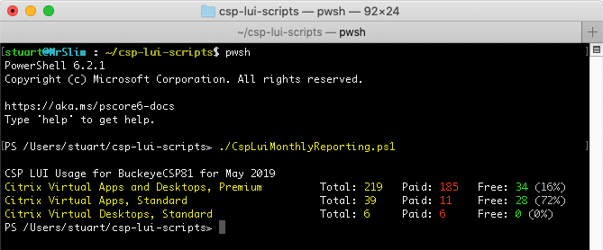
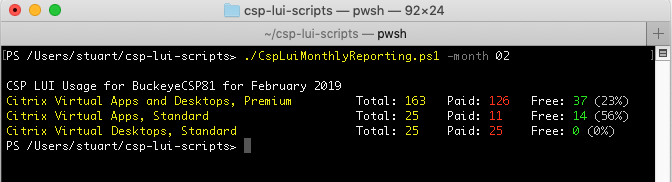
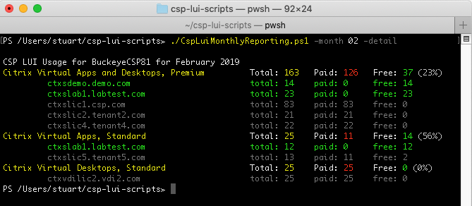

# CSP LUI Scripts
These scripts have been written to assist Citrix Service Providers utilise the [Citrix Cloud Licensing API](https://licensing.citrixworkspacesapi.net) to query usage and status. They are read-only and **do not** make any amendments, they simply execute GET requests for data, with some options for dumping out the results, either to the console or .csv file (or both).

**Use at your own risk** as these are not Citrix supported scripts. They have been written by myself as a proof-of-concept.

Written with and **only tested on** PowerShell Core 6+. They will error if used with earlier versions.

### Citrix Cloud API Secure Client Token
A Citrix Cloud API Secure Client token will need to be created and the variables at the start of each script amended.
 
To create an API key:
1.	Go to ‘hamburger’ menu in CC and select **Identity and Access Management**
2.	Select the **API Access** tab
3.	Note the **CustomerID** from the screen
4.	Specify a name for the client and hit the **Create Client** button

5.	Download the resulting ID and Secret
6.	Replace the values for **`$clientId`**, **`$clientSecret`** and **`$customerID`** with the values you noted/downloaded, towards the top of the script, in the section marked **`# Specify Citrix Cloud API credentials`**

### CspLuiMonthlyReporting.ps1
Ran without any switches, **CspLuiMonthlyReporting.ps1** will default to querying the usage for the previous month, displaying totals for each SKU, paid and free users. The following switches are available:
 
* **`-month xx`** (where xx is the month number required) specifies the month to query
* **`-year xxxx`** (where xxxx is the year) specifies the year to query
* **`-detail`** forces the output (not CSV output) to show detail per server (as well as per SKU)
* **`-csv`** causes a comma delimited file of the SKU usage to be dumped to the current directory. If a different directory is required, amend the default value at the top of the script or use the -csvfilepath switch. The file created will be named **`LUI_Report_<customerID>_<year>-<month>.csv`**.
* **`-csvfilepath`** amends the file output path for the .csv file (e.g. -csvfilepath c:\temp). Only relevant with the -csv switch above.
* **`-quiet`** prevents output to screen
* **`-send`** causes the .csv file name to be output to the PoSH pipeline

