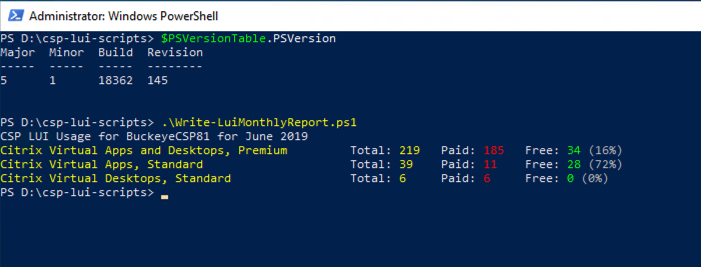

# CSP LUI Scripts
These scripts have been written to assist Citrix Service Providers utilise the [Citrix Cloud Licensing API](https://licensing.citrixworkspacesapi.net) to query usage and status. They are read-only and **do not** make any amendments, they simply execute GET requests for data, with some options for dumping out the results, either to the console or .csv file (or both).

**Use at your own risk** as these are not Citrix supported scripts. They have been written by myself as a proof-of-concept.

Written with and **only tested on** PowerShell Core 6+. They will probably error if used with earlier versions. That said, it seems to work on my Windows 10, PowerShell 5.1 test VM.

### Citrix Cloud API Secure Client Token
A Citrix Cloud API Secure Client token will need to be created. The API client details can then either be saved to a JSON file, using the Save-CredentialsFile.ps1 script, or entered manually each time the scripts are run.
 
To create an API key:
1.	Go to ‘hamburger’ menu in CC and select **Identity and Access Management**
2.	Select the **API Access** tab
3.	Note the **CustomerID** from the screen
4.	Specify a name for the client and hit the **Create Client** button

5.	Download the resulting ID and Secret
6.	Replace the values for **`$clientId`**, **`$clientSecret`** and **`$customerID`** with the values you noted/downloaded, towards the top of the script, in the section marked **`# Specify Citrix Cloud API credentials`**

### Scripts
1.  [Save-CredentialsFile.ps1](docs/Save-CredentialsFile.md) - Create a JSON formated credentials file of Citrix Cloud API client values.
2.  [Write-LuiMonthlyReport.ps1](docs/Write-LuiMonthlyReport.md) - Displays or exports to CSV VA&D LUI usage for given month.
3. [Write-LuiServerStatus.ps1](docs/Write-LuiServerStatus.md) - Displays or exports to CSV Citrix license server(s).
4. [Get-LuiServerStatus.ps1](docs/Get-LuiServerStatus.md) - Returns an PoSH object of Citrix licenser server(s), or a subset with in a specified condition.
