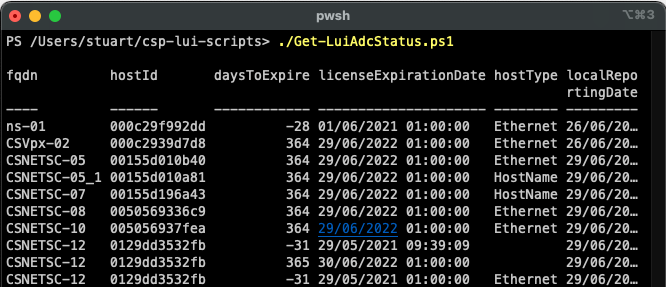
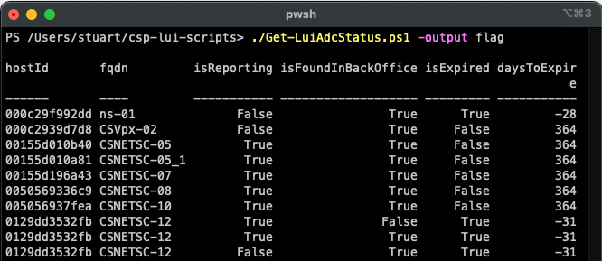
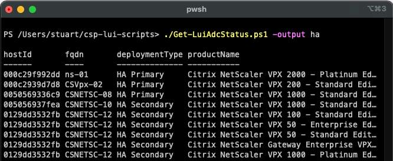

# CSP LUI Scripts
## Get-LuiAdcStatus.ps1

Ran without any switches, **Get-LuiAdcStatus.ps1** will default to returning a single PS object containing status summary of all ADCs (CSP licensed).

The only switch available is the **-output** switch, which amends the object and associated properties returned. The values recognised by the **-output** switch is shown below:

* **`-output flag`** - Returns ADCs with any warning or error flag set. 
* **`-output notreporting`** - Returns ADCs not reporting.
* **`-output notfound`** - Returns ADCs not found in back office databases.
* **`-output expired`** - Returns ADCs with expired licenses.
* **`-output expiring`** - Returns ADCs with licenses expiring within 90 days.
* **`-output standalone`** - Returns single node ADCs (not HA or Clustered).
* **`-output ha`** - Returns ADCs in HA pairs.
* **`-output clustered`** - Returns clustered ADCs.
* **`-outpur active`** - Returns active node ADCs.

Some examples of the **`-output`** switch shown in the screenshots below:

[back](../README.md)