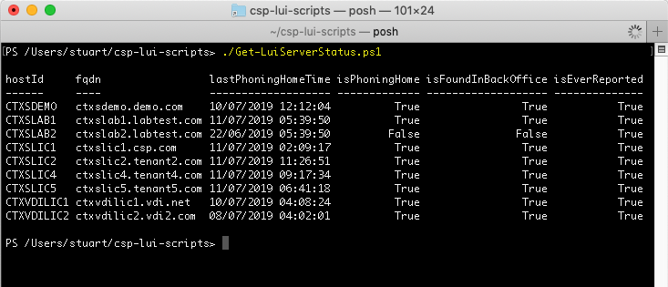
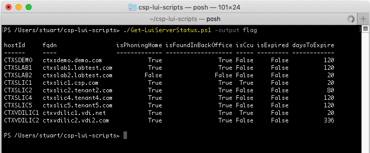
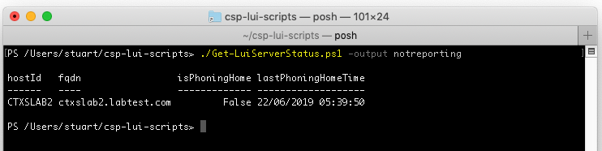

# CSP LUI Scripts
## Get-LuiServerStatus.ps1

Ran without any switches, **Get-LuiServerStatus.ps1** will default to returning a single PS object containing status summary of all license servers.

The only switch available is the **-output** switch, which amends the object and associated properties returned. The values recognised by the **-output** switch is shown below:

* **`-output flag`** - Returns servers with any warning, error or information flag set. 
* **`-output notreporting`** - Returns servers that are not reporting.
* **`-output never`** - Returns servers that have never reported.
* **`-output notfound`** - Returns servers not found in back office databases.
* **`-output noncsp`** - Returns license servers hosting non-CSP licenses.
* **`-output expired`** - Returns license servers with expired licenses.
* **`-output expiring`** - Returns license servers with licenses expiring within 90 days.
* **`-output free`** - Returns license servers marked as 'free'.
* **`-output all`** - Returns all servers (same as running without any switch).

A **`null`** value will be returned if no matching servers are found.

Some examples of the **`-output`** switch shown in the screenshots below:

[back](../README.md)