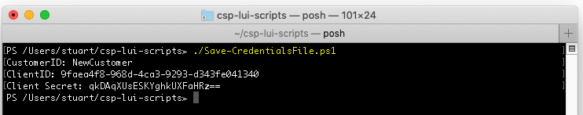
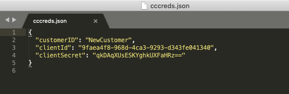

# CSP LUI Scripts
## Save-CredentialsFile.ps1
This is s simple script to help in creaing a JSON formatted credentials file, for use with the other scripts in this repository.

Ran without any switches, **Save-CredentialsFile.ps1** will prompt the user to input or pasted the required details at the prompt.

These details are saved in the file **cccreds.txt**, in the same directory.

This script has no switches.

[back](../README.md)