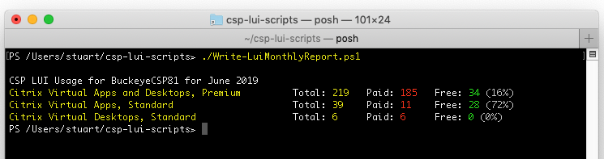
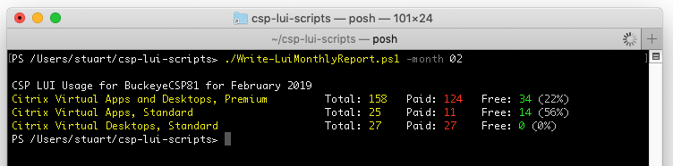
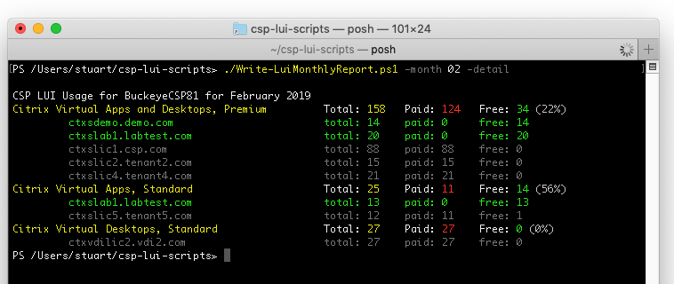

# CSP LUI Scripts
##Write-LuiMonthlyReport.ps1
Ran without any switches, **Write-LuiMonthlyReport.ps1** will default to querying the usage for the previous month, displaying totals for each SKU, paid and free users.

The following switches are available:

* **`-month xx`** (where xx is the month number required) specifies the month to query
* **`-year xxxx`** (where xxxx is the year) specifies the year to query
* **`-detail`** forces the output (not CSV output) to show detail per server (as well as per SKU)
* **`-csv`** causes a comma delimited file of the SKU usage to be dumped to the current directory. If a different directory is required, amend the default value at the top of the script or use the -csvfilepath switch. The file created will be named **`LUI_Report_<customerID>_<year>-<month>.csv`**.
* **`-csvfilepath`** amends the file output path for the .csv file (e.g. -csvfilepath c:\temp). Only relevant with the -csv switch above.
* **`-quiet`** prevents output to screen
* **`-send`** causes the .csv file name to be output to the PoSH pipeline

[back](../README.md)