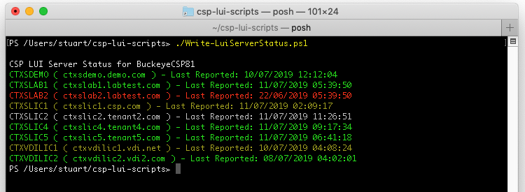

# CSP LUI Scripts
## CspLuiServerStatus.ps1

Ran without switches, **CspLuiServerStatus.ps1** will default to querying the current reporting status for all servers listed for a given CustomerID.

The following switches are available:
* **`-output <option>`** restricts status report to criteria specified by the option. Options available are:
-- `error` returns only servers with an error flag set
-- `warning` returns servers a warning and error flags set
-- `flag` returns servers with any flag set
-- `ccu` returns servers with CCU warning(s)
-- `expiring`returns servers with an license expiration warning
* **`-detail`** forces the output (not CSV output) to show detail per server, including messages, warnings and errors
* **`-csv`** causes a comma delimited file of the server status to be dumped to the current directory. If a different directory is required, amend the default value at the top of the script or use the -csvfilepath switch. The file created will be named **`LUI_ServerStatus_<customerID>_<year>-<month>.csv`**.
* **`-csvfilepath`** amends the file output path for the .csv file (e.g. -csvfilepath c:\temp). Only relevant with the -csv switch above.
* **`-quiet`** prevents output to screen

[back](../README.md)